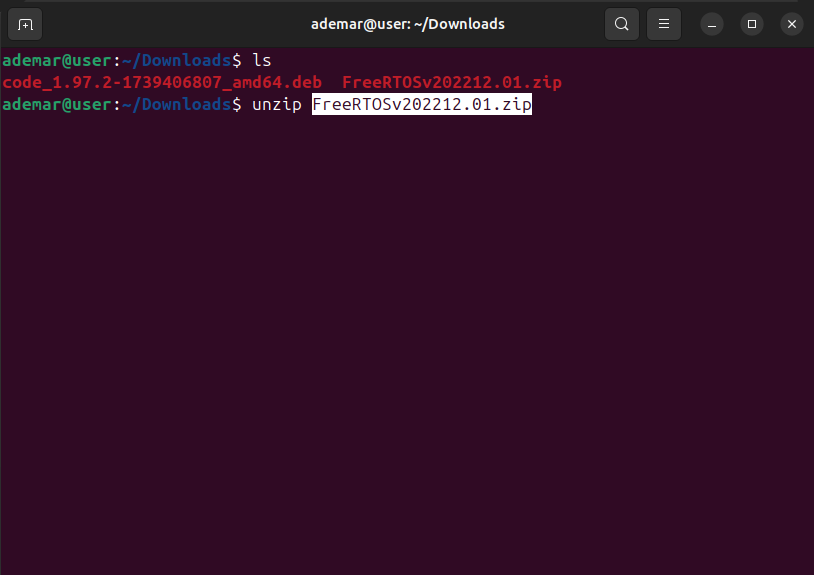

# Instalação e Configuração do FreeRTOS e Visual Studio Code no Ubuntu
## Referência:
[Vídeo tutorial de configuração do FreeRTOS no Ubuntu](https://www.youtube.com/watch?v=wZmXPj1YvBg)

## Downloads Necessários

- **FreeRTOS**: Baixe do [site oficial do FreeRTOS](https://freertos.org). Selecione a versão `.deb` conforme indicado na imagem.

<p align="center">
  
</p>
  
- **Visual Studio Code**: Baixe do [site oficial do Visual Studio Code](https://code.visualstudio.com/). Selecione a versão `.deb` conforme indicado na imagem.

> Salve os arquivos em Downloads.

## Dicas de Utilização do Terminal

Antes de iniciar, aqui estão algumas dicas para navegação e comandos básicos no terminal:
- `pwd`: Exibe o diretório de acesso atual do terminal.
- `ls`: Exibe informações sobre os arquivos no diretório de acesso atual do terminal.
- `cd 'Destino'/`: Muda o acesso atual do terminal para um diretório específico.
- `mv 'nome_do_arquivo' 'Destino'/`: Move o arquivo. Exemplo: `mv 'FreeRTOSv202212.01' ~/`.
- `unzip 'nome_do_arquivo'`: Extrai o arquivo para a mesma pasta que ele está.
- `Ctrl+l`: Limpa a tela do terminal.
- `Ctrl+Shift+c`: Copia.
- `Ctrl+Shift+v`: Cola.
- `Ctrl+Alt+t`: Abre um novo terminal.

> Atenção para a diferenciação entre maiúsculas e minúsculas.

> Lembre-se de sempre confirmar as instalações através do comando 'Y+Enter' ou simplesmente 'Enter'.

## 1. Descompactando e Instalando Arquivos

### Abra o terminal do Linux
Use o atalho `Ctrl+Alt+t`


### Instale Meta Pacotes Fundamentais para Compilação

```bash
sudo apt install build-essential
```

<p align="center">
  
</p>

### Acesse os Arquivos Baixados em Downloads

```bash
cd Downloads
```

### Liste os Arquivos Presentes em Downloads

```bash
ls
```

<p align="center">
  
</p>

### Instale o Visual Studio Code
Substitua o 'nome_do_arquivo.deb' pelo nome do arquivo do VScode que o comando `ls` exibiu

```bash
sudo dpkg -i 'nome_do_arquivo.deb'
```

<p align="center">
  
</p>

### Descompacte o FreeRTOS
Substitua o 'nome_do_arquivo.zip' pelo nome do arquivo do FreeRTOS que o comando `ls` exibiu

```bash
unzip 'nome_do_arquivo.zip'
```

<p align="center">
  
</p>

### Mova a Pasta Descompactada do FreeRTOS para a Pasta 'Home'
Substitua o 'nome_da_pasta_FreeRTOS' pelo nome do arquivo do FreeRTOS recém descompactado (veja os arquivos através do comando `ls` novamente)
```bash
mv 'nome_da_pasta_FreeRTOS' ~/
```
<p align="center">
  
</p>

### Instale o Git
Instale também o Git, para que seja possível clonar bibliotecas do github a partir do VSCode
```bash
sudo apt install git
```

## 2. Configurando Referência ao FreeRTOS

Configuraremos uma variável de ambiente para indicar onde o FreeRTOS está localizado, e faremos essa variável ser inicializada junto com o sistema.

### Configure a Variável de Ambiente
O seguinte comando define a variável de ambiente FREERTOS_PATH referenciada ao endereço da pasta. Para isso, modifique 'nome_da_pasta_do_FreeRTOS' pelo nome visto anteriormente
```bash
export FREERTOS_PATH=~/'nome_da_pasta_do_FreeRTOS'
```

<p align="center">
  
</p>

### Tornando a Configuração Permanente

Como as configurações de variáveis de ambiente se perdem ao reiniciar a máquina, precisamos fazer com que a variável de ambiente seja configurada automaticamente na inicialização do sistema.

Acesse a pasta Home
```bash
cd
```

### Abra o arquivo .profile para adicionar a variável de ambiente permanentemente
```bash
nano .profile
```

<p align="center">
  
</p>

### Vá até o fim do arquivo e adicione a linha (lembre-se de substituir 'nome_da_pasta_do_FreeRTOS' pelo nome real):
```bash
export FREERTOS_PATH=~/'nome_da_pasta_do_FreeRTOS'
```

<p align="center">
  
</p>

> Em caso de alteração do nome da pasta do FreeRTOS (por exemplo, mudança de versão), é necessário editar o caminho novamente no arquivo `.profile`.

### Salvar e Sair do Nano
Para salvar basta pressionar as teclas 'Ctrl+x' e confirmar com 'y'
Feito isso, basta pressionar 'Enter' para sair

### Testando a Configuração

Para testar se a configuração foi aplicada corretamente, você pode executar o arquivo `.profile` para aplicar as mudanças imediatamente:

```bash
source .profile
```

> Caso deseje testar se a variável foi configurada corretamente, você pode usar o comando `echo $FREERTOS_PATH`, que deve retornar o caminho que você configurou.


## 3. Uso do VSCode + FreeRTOS
Faremos as primeiras configurações no VSCode e o download do repostório teste.

### Abra o VSCode
Enquanto o sistema ainda não foi reiniciado, é necessário abrir o VSCode através do terminal:

```bash
code
```

### Clone o repositório teste
Clique na opção 'Clone Git Repository' e cole o link do repositório:

```plaintext
https://github.com/vsserafim/twotasks-posix-gcc.git
```

> Crie uma pasta em documentos, evitando colocar espaços no nome. Sugestão: Documentos/Projetos_FreeRTOS

> O arquivo Makefile, presente no repositório, necessita da variável de ambiente que configuramos, por essa razão o nome 'FREERTOS_PATH' não pode ser alterado.

### Instale as extensões do C e C++
Procure por 'C/C++' da Microsoft e outras extensões necessárias para o desenvolvimento com FreeRTOS e instale-as através da aba de extensões no VSCode.

### Execute o projeto
Abra o arquivo 'main' e execute o o atalho `ctrl+shift+b (>Run Build Task)

### Visualizando teste através do terminal
Podemos verificar a funcionalidade do programa através do terminal do VSCode ou do linux. Utilizaremos o terminal do linux.
Se o repositório estiver salvo na página com o nome e local sugeridos, abra a pasta onde a tarefa está através do comando:

```bash
cd Documents/Projetos_FreeRTOS/twotasks-posix-gcc/build
```

```bash
./modelo-posix-gcc
```

O programa de teste executa duas tarefas e exibe na tela a sua conclusão
