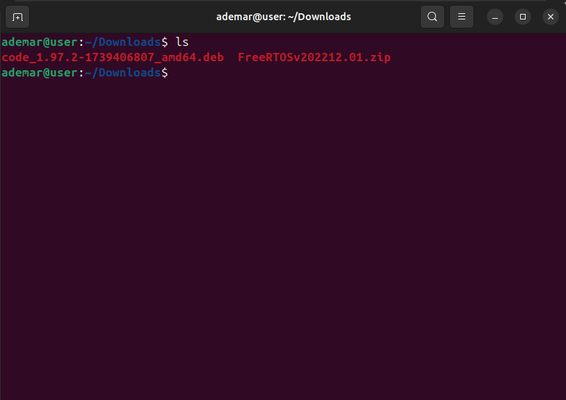
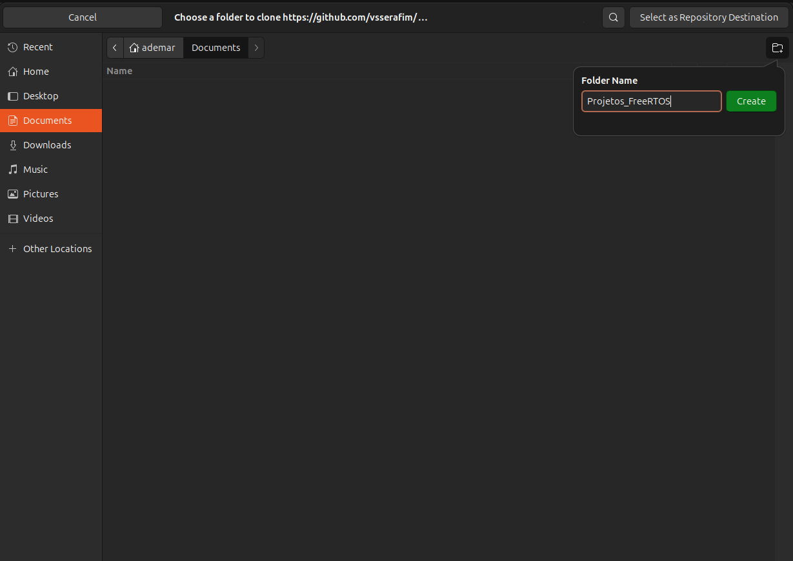
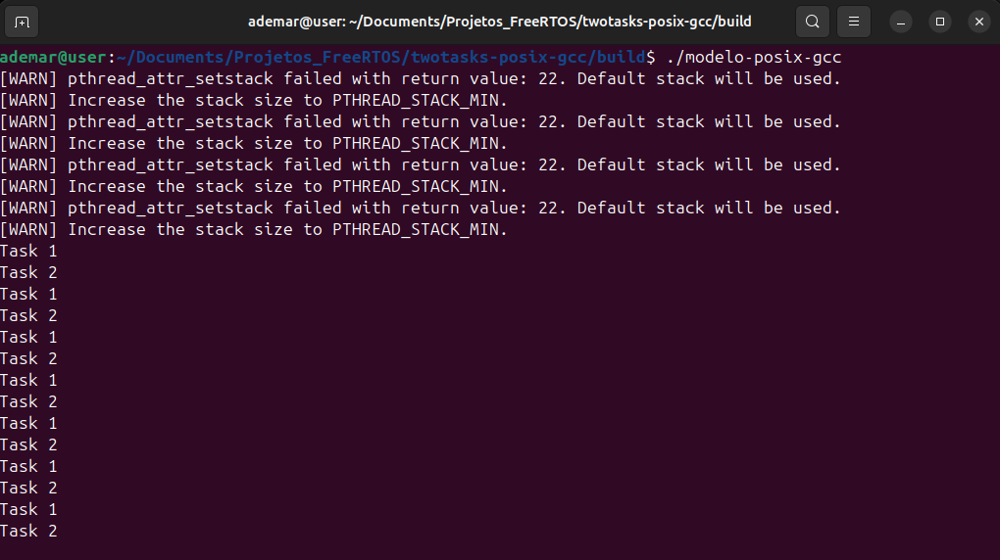

# Instalação e Configuração do FreeRTOS e Visual Studio Code no Ubuntu
## Referência: [Vídeo tutorial de configuração do FreeRTOS no Ubuntu](https://www.youtube.com/watch?v=wZmXPj1YvBg)

## Downloads Necessários

- **FreeRTOS**: Baixe do [site oficial do FreeRTOS+VSCode](https://freertos.org).  Selecione a versão normal, conforme indicado na imagem abaixo

<p align="center">
  
</p>
  
- **Visual Studio Code**: Baixe do [site oficial do Visual Studio Code](https://code.visualstudio.com/).

> Salve os arquivos em Downloads

## Dicas de Utilização do Terminal

Antes de iniciar, aqui estão algumas dicas para navegação e comandos básicos no terminal:
- `pwd`: Exibe o diretório de acesso atual do terminal
- `ls`: Exibe informações sobre os arquivos no diretório de acesso atual do terminal
- `cd 'Destino'/`: Muda o acesso atual do terminal para um diretório específico
- `mv 'nome_do_arquivo' 'Destino'/`: Move o arquivo. Exemplo: `mv 'FreeRTOSv202212.01' ~/`
- `unzip 'nome_do_arquivo'`: Extrai o arquivo para a mesma pasta que ele está
- `Ctrl+l`: Limpa a tela do terminal
- `Ctrl+Shift+c`: Copia
- `Ctrl+Shift+v`: Cola
- `Ctrl+Alt+t`: Abre um novo terminal

> Atenção para a diferenciação entre maiúsculas e minúsculas

> Lembre-se de sempre confirmar as instalações através do comando 'Y+Enter' ou simplesmente 'Enter'

> Quando o comando `sudo` for usado, será necessário inserir a senha do usuário administrador da máquina

## 1. Instalação e Configuração Inicial

### Abra o terminal do Linux
É possível abrir o terminal pressionando o atalho `Ctrl+Alt+t` ou a teclado 'Win' e pesquisando por 'Terminal'

### Instale Meta Pacotes Fundamentais para Compilação
Com o terminal aberto, execute o comando abaixo para baixar meta pacotes necessários

```bash
sudo apt install build-essential
```

<p align="center">
  
</p>

### Acesse os Arquivos Baixados em Downloads
Vá até a pasta downloads, onde os arquivos baixados estarão

```bash
cd Downloads
```

<p align="center">
  
</p>

### Liste os Arquivos Presentes em Downloads
Use o comando `ls` para listar os arquivos na pasta

```bash
ls
```

<p align="center">
  
</p>

### Instale o Visual Studio Code
Substitua o 'nome_do_arquivo.deb' pelo nome do arquivo do VScode que o comando `ls` exibiu, e execute o comando abaixo no terminal

```bash
sudo dpkg -i 'nome_do_arquivo.deb'
```

<p align="center">
  
</p>

### Descompacte o FreeRTOS
Substitua o 'nome_do_arquivo.zip' pelo nome do arquivo do FreeRTOS que o comando `ls` exibiu, e execute o comando abaixo no terminal

```bash
unzip 'nome_do_arquivo.zip'
```

<p align="center">
  
</p>

### Mova a Pasta Descompactada do FreeRTOS para a Pasta 'Home'
Substitua o 'nome_da_pasta_FreeRTOS' pelo nome do arquivo do FreeRTOS recém descompactado (veja os arquivos através do comando `ls` novamente)

```bash
mv 'nome_da_pasta_FreeRTOS' ~/
```

> Atenção para não mover o arquivo .zip por engano

<p align="center">
  
</p>

### Instale o Git
Instale também o Git executando o comando abaixo, para que seja possível clonar bibliotecas do github a partir do VSCode

```bash
sudo apt install git
```

## 2. Configuração de Variável de Ambiente

Configuraremos uma variável de ambiente para indicar onde o FreeRTOS está localizado, e faremos essa variável ser inicializada junto com o sistema

### Configure a Variável de Ambiente
O comando abaixo define a variável de ambiente `FREERTOS_PATH` referenciada ao endereço da pasta. Para isso, modifique 'nome_da_pasta_do_FreeRTOS' pelo nome da pasta movida anteriormente, e execute o comando abaixo

```bash
export FREERTOS_PATH=~/'nome_da_pasta_do_FreeRTOS'
```

<p align="center">
  
</p>

### Tornando a Configuração Permanente
Como as configurações de variáveis de ambiente se perdem ao reiniciar a máquina, precisamos fazer com que a variável de ambiente seja configurada automaticamente na inicialização do sistema

Para isso, retorne à pasta Home através do comando abaixo

```bash
cd
```

### Abra o arquivo .profile para adicionar a variável de ambiente permanentemente
Use o comando abaixo para abrir o o arquivo .profile no editor nano

```bash
nano .profile
```

<p align="center">
  
</p>

### Edite o arquivo .profile
Vá até o final do arquivo e inclua o comando abaixo (lembre-se de substituir 'nome_da_pasta_do_FreeRTOS' pelo nome real)

```bash
export FREERTOS_PATH=~/'nome_da_pasta_do_FreeRTOS'
```

<p align="center">
  
</p>

> Em caso de alteração do nome da pasta do FreeRTOS (por exemplo, com uma mudança de versão), é necessário editar o caminho novamente no arquivo `.profile`

### Salvar e Sair do Nano
Para salvar basta pressionar as teclas `Ctrl+x` e confirmar com `y`

Feito isso, basta pressionar `Enter` para sair

### Testando a Configuração

Para testar se a configuração foi aplicada corretamente, você pode executar o arquivo `.profile` para aplicar as mudanças imediatamente através do comando abaixo

```bash
source .profile
```

> Caso deseje testar se a variável foi configurada corretamente, você pode usar o comando `echo $FREERTOS_PATH`, que deve retornar o caminho que você configurou


## 3. Uso do VSCode + FreeRTOS
Faremos as primeiras configurações no VSCode e o download do repostório teste

### Abra o VSCode
Enquanto o sistema ainda não foi reiniciado, é necessário abrir o VSCode através do terminal, use do comando abaixo

```bash
code
```

### Clone o repositório teste
Clique na opção 'Clone Git Repository' e cole o link do repositório abaixo, conforme indicado na imagem abaixo

```plaintext
https://github.com/vsserafim/twotasks-posix-gcc.git
```

<p align="center">
  
</p>

Crie uma pasta em documentos, evitando colocar espaços no nome
Sugestão: Projetos_FreeRTOS

<p align="center">
  
</p>

> O arquivo Makefile, presente no repositório, necessita da variável de ambiente que configuramos, por essa razão o nome 'FREERTOS_PATH' não deve ser alterado

### Instale as extensões do C e C++
Procure por `C/C++` da Microsoft e instale-o através da aba de extensões no VSCode

<p align="center">
  
</p>

> Ao abrir o arquivo main pela primeira vez possivelmente aparecerá um pop-up requisitando mais extensões, basta aceitar 

### Execute o projeto
Abra o arquivo 'main' e execute o atalho `ctrl+shift+b` (>Run Build Task) para rodar o arquivo

<p align="center">
  
</p>

### Visualizando teste através do terminal
Podemos verificar a funcionalidade do programa através do terminal do VSCode ou do linux

Utilizaremos o terminal do linux

Se o repositório estiver salvo na página com o nome e local sugeridos, abra a pasta onde a tarefa está através do comando abaixo

```bash
cd Documents/Projetos_FreeRTOS/twotasks-posix-gcc/build
```

E execute o arquivo através do comando abaixo
```bash
./modelo-posix-gcc
```

<p align="center">
  
</p>

O programa de teste executa duas tarefas e exibe na tela a sua conclusão

<p align="center">
  
</p>

### Agora o seu VSCode já está pronto para executar projetos do FreeRTOS
